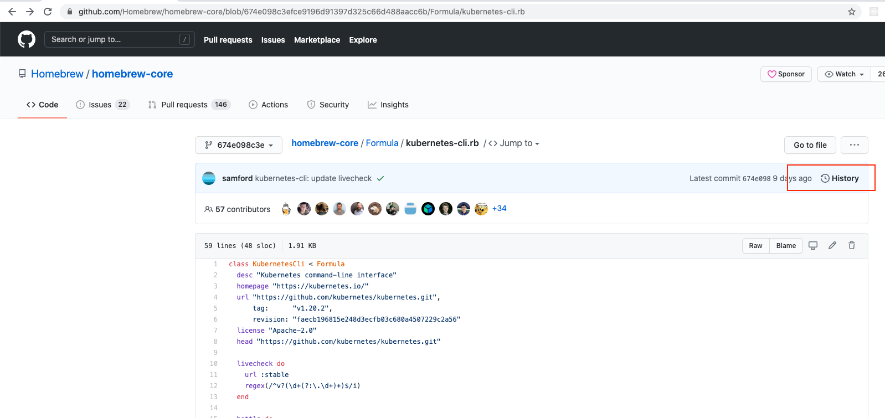
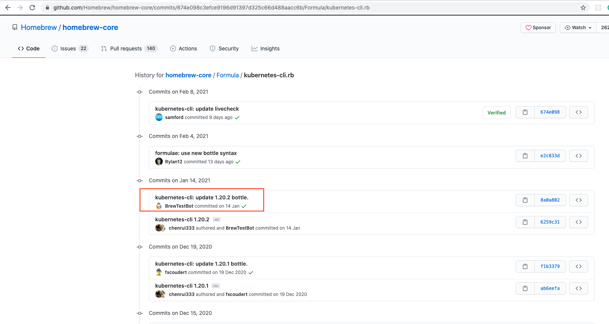
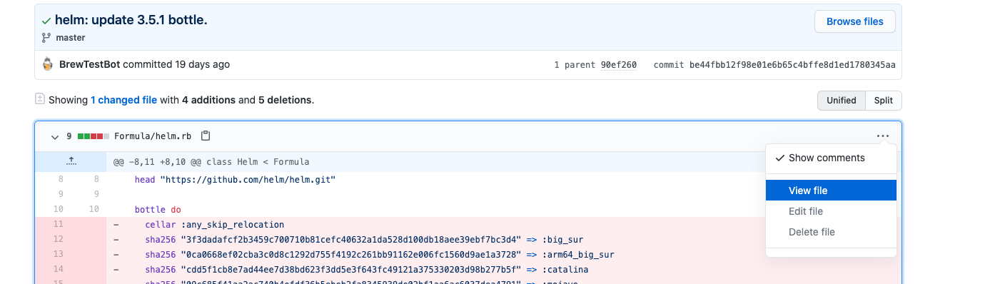
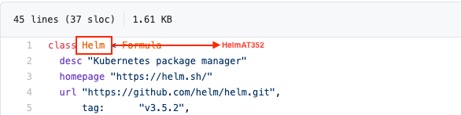
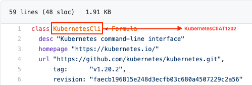

# Helm and Kubernetes-cli legacy versions

Attempt to rebuild previous versions of clients needed for communication with existing older production infrastructure

## Update with new formula

When new version of Helm or Kubernetes-cli is released, brew will update its packages. To view all the previous versions of the tool, we can visit the brew histories of [Helm](https://github.com/Homebrew/homebrew-core/commits/7877b4bbcfa48028349a5cbed0d2f6ef5dbcc84b/Formula/helm.rb) and [Kubernetes-cli](https://github.com/Homebrew/homebrew-core/commits/674e098c3efce9196d91397d325c66d488aacc6b/Formula/kubernetes-cli.rb) to view list of all the previous versions.

### Updating tap

1. Create a file `helm@<x.x.x>.rb` or `Kubernetes-cli@<x.x.x>.rb`

    ``e.g:  helm@3.10.1.rb or kubernetes-cli@1.18.8``

2. Copy the content of the formula
    1. Visit formula history in homebrew

    

    2. Click on specific version bottle

    

    3. Copy the content of the formula from the bottle file to the newly created tap file.

    

3. Change the formula class name

Class name of the formula should be changed to support installing specific version of the formula.

***File name should be helm@<x.x.x>.rb or Kubernetes-cli@<x.x.x>.rb
and Class name inside the file should be KubernetesCliAT<XXX>*** for kubernetes-cli but for Helm it should be as it is 'Helm'. 

`` e.g for helm@3.10.1.rb file class name should be HelmAT3101,
    for kubernetes-cli@1.18.8 file class name should be KubernetesCliAT1188 ``

:link: [Brew formula class naming convention documentation](https://docs.brew.sh/Versions.html)

## Testing new formula

We can test the new formula created by using brew command,

`brew install --build-from-source ./helm@3.3.0.rb`

## How do I install these formulae?

`brew install nintexplatform/homebrew-versions/<formula>`

`e.g brew install nintexplatform/homebrew-versions/helm@3.3.0`

Or 

`brew tap nintexplatform/homebrew-versions` and

then `brew install <formula>` e.g `brew install helm@3.3.0`.